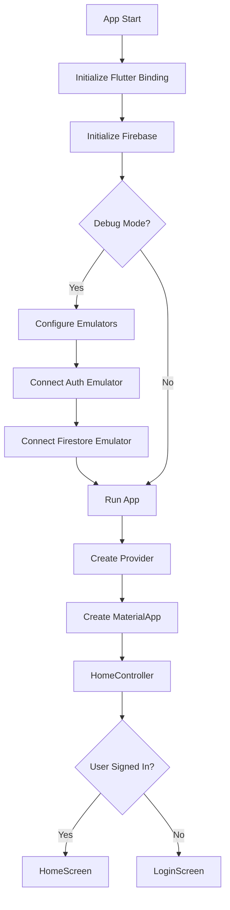
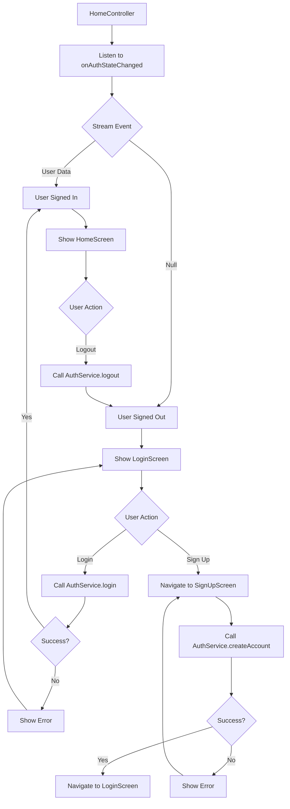
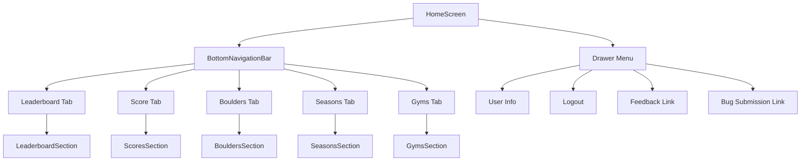
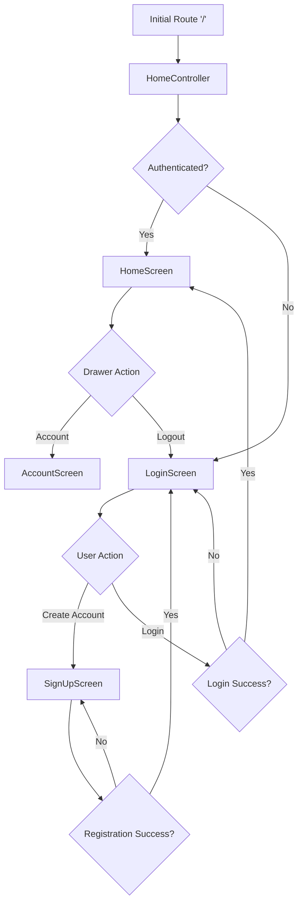
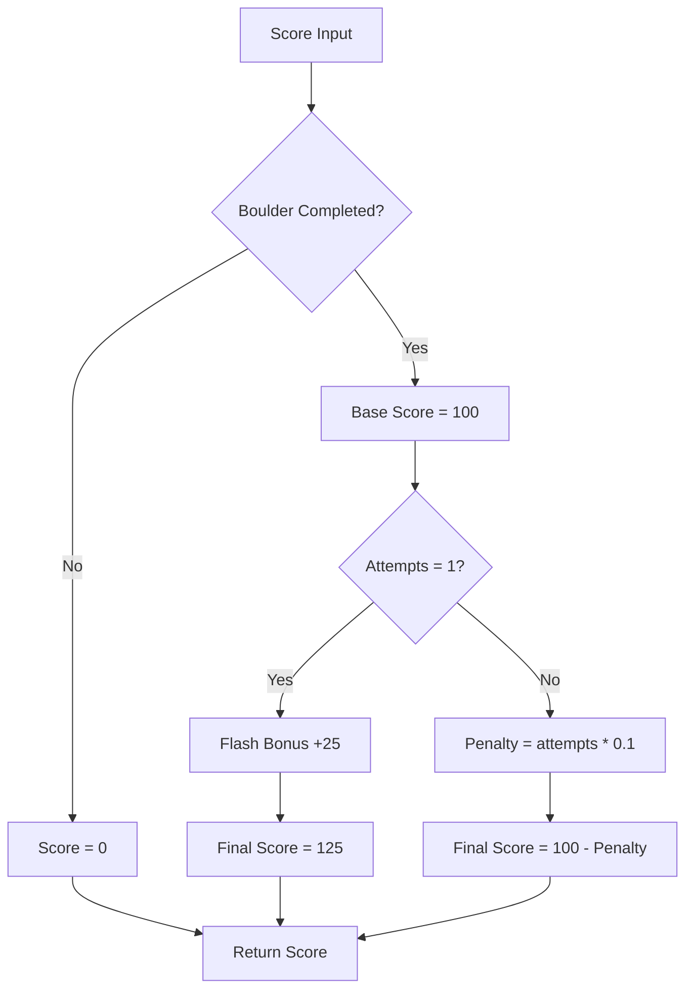
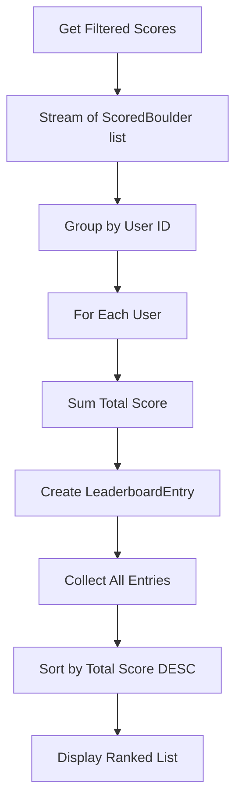
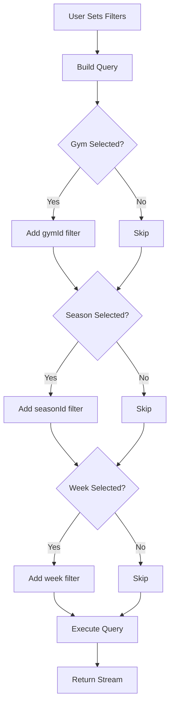
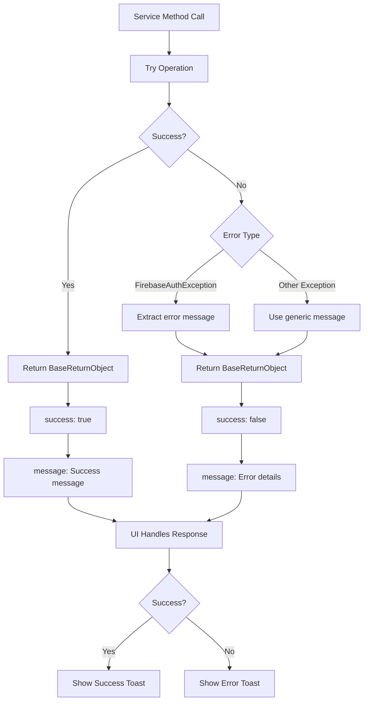
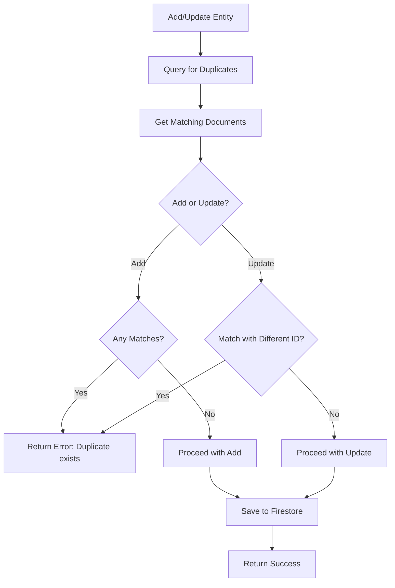
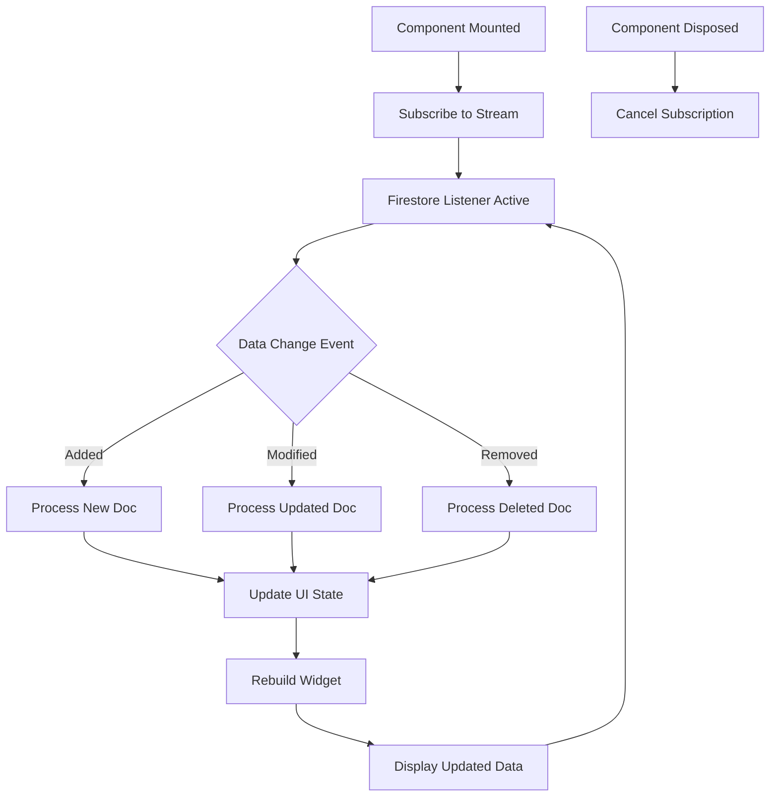

# Flow Diagrams

## Application State Flows

### App Initialization Flow

### Authentication State Flow

## Navigation Flows

### Main Navigation Structure

### Screen Navigation Flow

## Business Logic Flows

### Score Calculation Flow

### Leaderboard Aggregation Flow

### Data Filtering Flow

## Error Handling Flows

### Service Error Handling Flow

### Duplicate Check Flow

## Data Synchronization Flow

### Real-time Updates Flow

---
*Generated by docs-generator agent on 2025-11-20 15:45*
