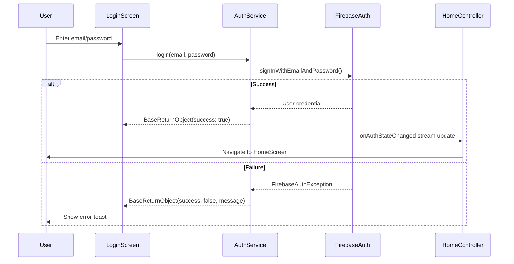
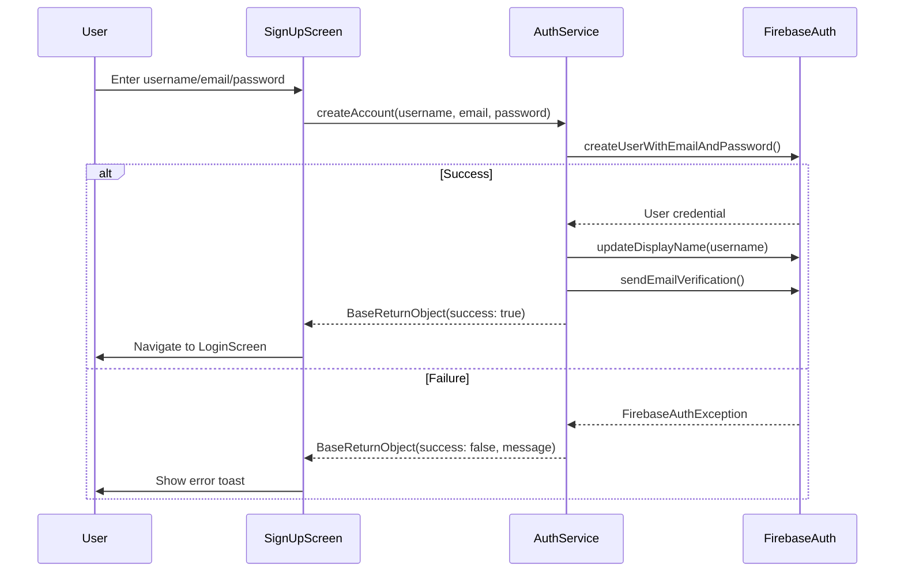
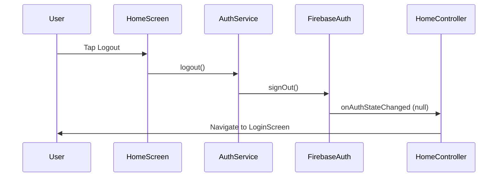
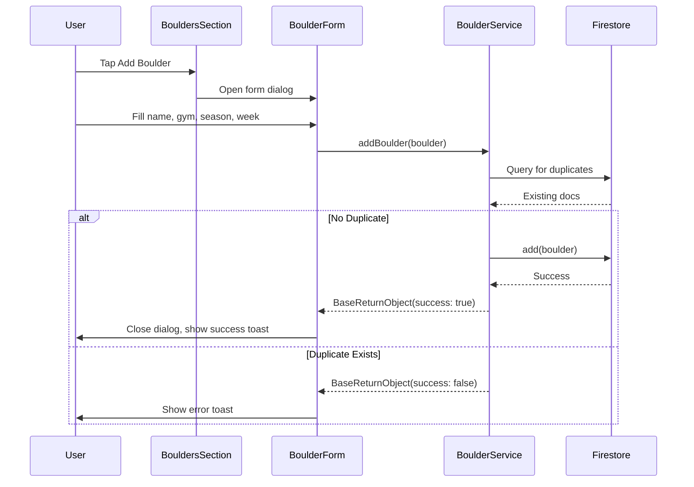
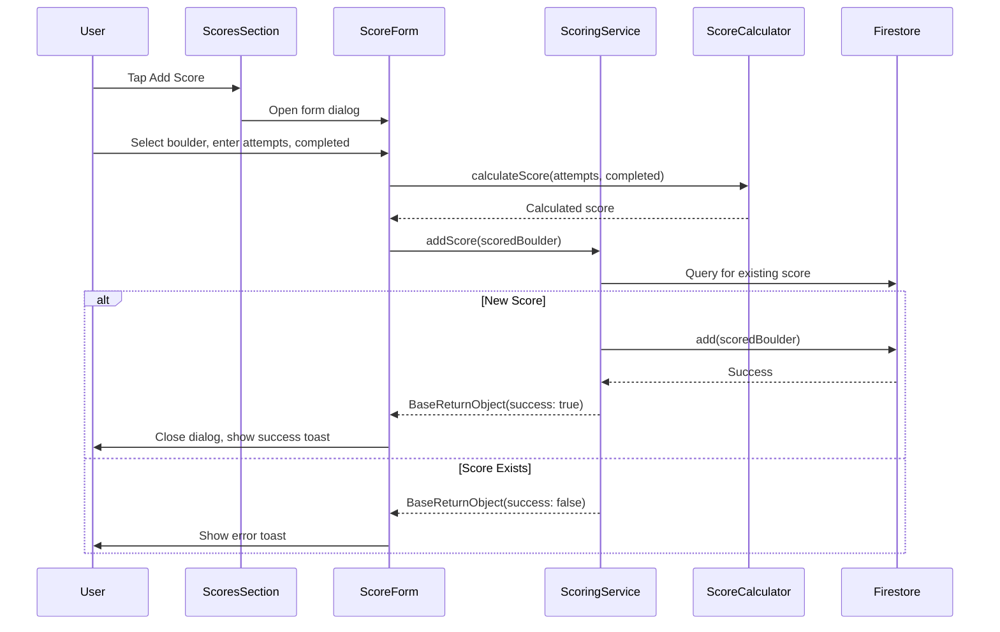
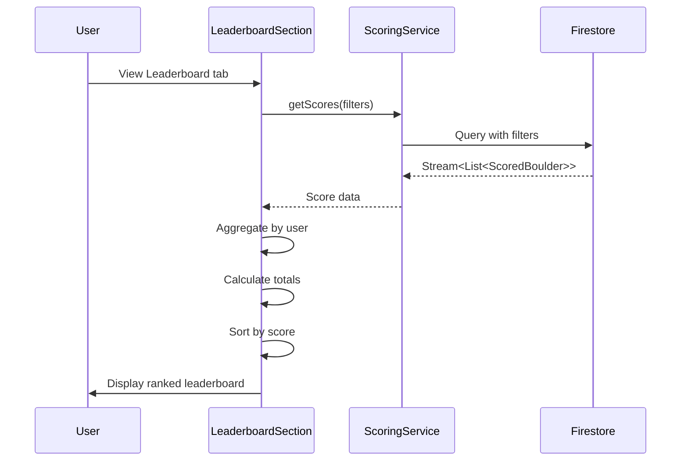
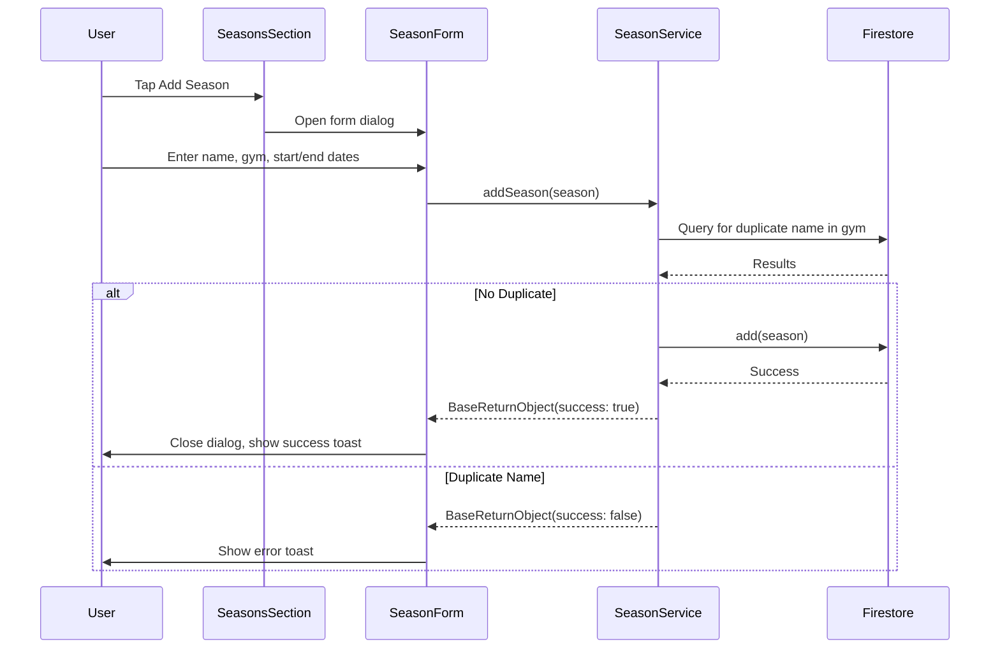
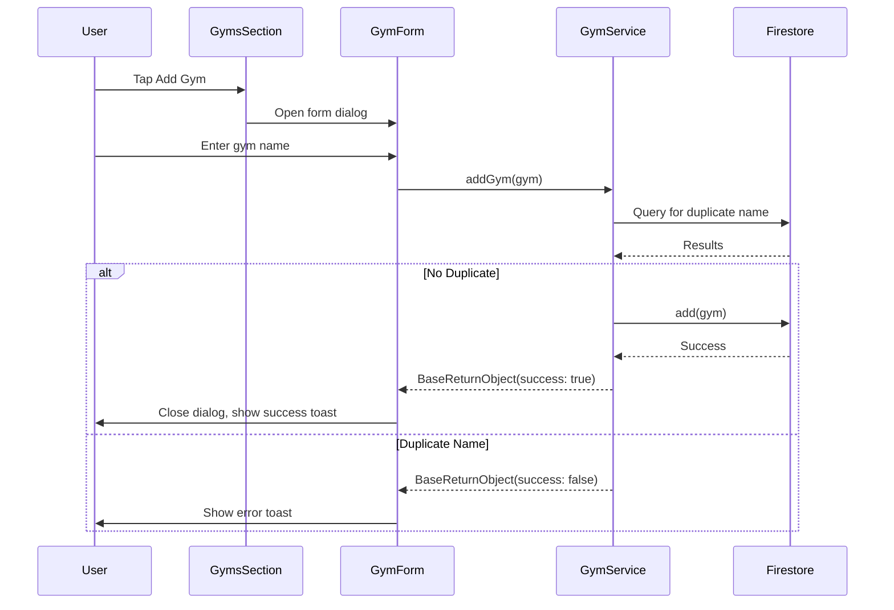
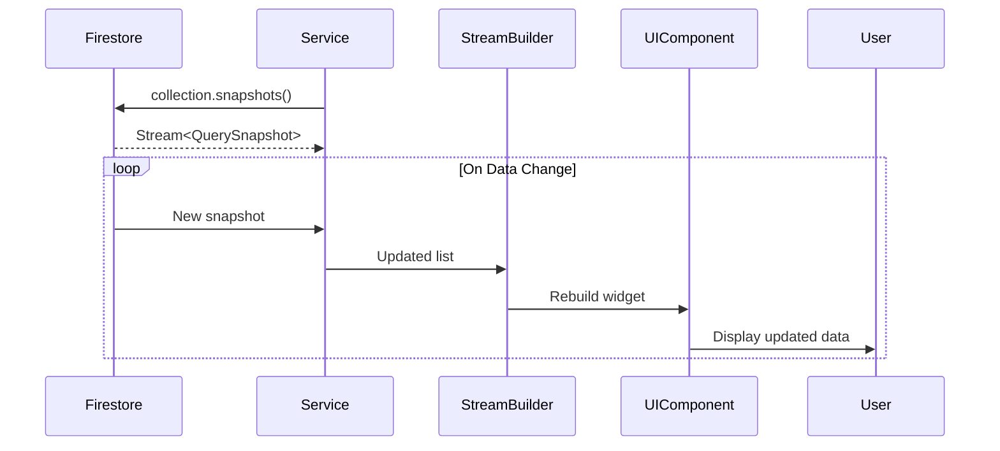

# Sequence Diagrams

## Authentication Flows

### User Login Flow

### User Registration Flow

### User Logout Flow

## Data Management Flows

### Add Boulder Flow

### Record Score Flow

### Load Leaderboard Flow

### Create Season Flow

### Create Gym Flow

## Real-time Data Sync

### Stream-based Data Updates

---
*Generated by docs-generator agent on 2025-11-20 15:45*
